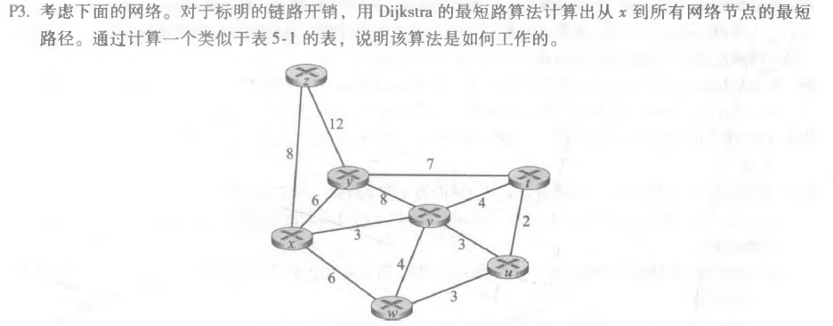
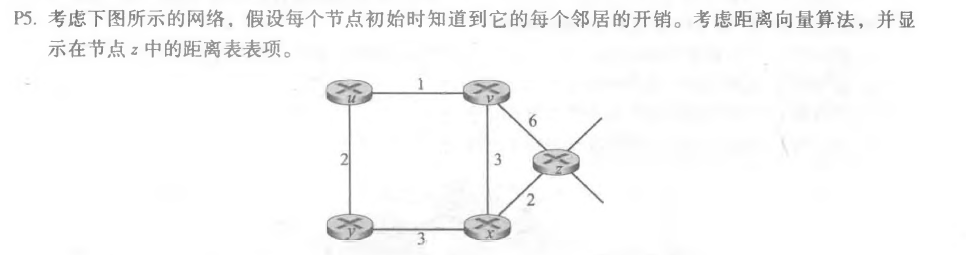
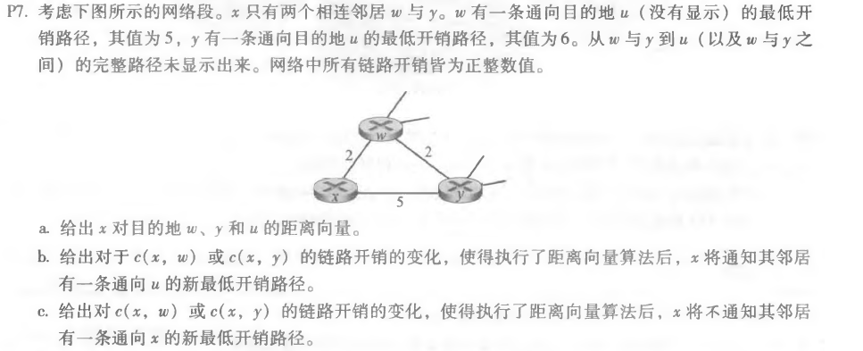

##### 2017301530080 王润泽

---

### P3

| 步骤 |   N’    | D(z),P(z) | D(y),P(y) | D(v),P(v) | D(w),P(w) | D(u),P(u) | D(t),P(t) |
| :--: | :-----: | :-------: | :-------: | :-------: | :-------: | :-------: | --------- |
|  0   |    x    |    8,x    |    6,x    |    3,x    |    6,x    |     ∞     | ∞         |
|  1   |   xv    |    8,x    |    6,x    |           |    6,x    |    6,v    | 7,v       |
|  2   |   xvu   |    8,x    |    6,x    |           |    6,x    |           | 7,v       |
|  3   |  xvuw   |    8,x    |    6,x    |           |           |           | 7,v       |
|  4   |  xvuwy  |    8,x    |           |           |           |           | 7,v       |
|  5   | xvuwyt  |    8,x    |           |           |           |           |           |
|  6   | xvuwytz |           |           |           |           |           |           |

### P5

初始z与其邻居的距离：

|      | z    | v    | x    | u    | y    |
| ---- | ---- | ---- | ---- | ---- | ---- |
| z    | 0    | 6    | 2    | ∞    | ∞    |
| v    | ∞    | ∞    | ∞    | ∞    | ∞    |
| x    | ∞    | ∞    | ∞    | ∞    | ∞    |

添加v、x与其邻居的距离：

|      | z    | v    | x    | u    | y    |
| ---- | ---- | ---- | ---- | ---- | ---- |
| z    | 0    | 5    | 2    | 7    | 5    |
| v    | 6    | 0    | 3    | 1    | ∞    |
| x    | 2    | 3    | 0    | ∞    | 3    |

添加u，y与其邻居的距离

|      | z    | v    | x    | u    | y    |
| ---- | ---- | ---- | ---- | ---- | ---- |
| z    | 0    | 5    | 2    | 6    | 5    |
| v    | 6    | 0    | 3    | 1    | 3    |
| x    | 2    | 3    | 0    | 4    | 3    |

### P7

a.

|      | x    | y    | w    | u    |
| ---- | ---- | ---- | ---- | ---- |
| x    | 0    | 4    | 2    | 7    |

b.

原x到u最低开销路径为x到w再到u

因此有：c(x,w)+5<c(x,y)+6，其中c(x,w)=2,c(x,y)=4

由于生成了新的最低开销路径，则有c(x,w)+5>c(x,y)+6

若仅有c(x,w)变化，那么c(x,w)>5

若仅有c(x,y)变化，那么c(x,y)<1

c.

由于未生成新的最低开销路径，则有c(x,w)+5<c(x,y)+6

若仅有c(x,w)变化，那么c(x,w)≤5

若仅有c(x,y)变化，那么c(x,y)≥1

