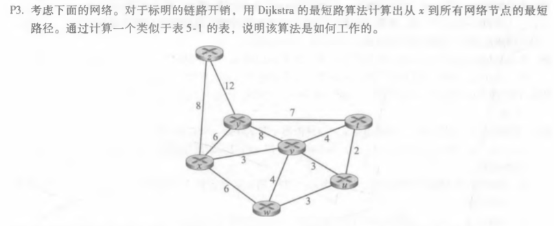
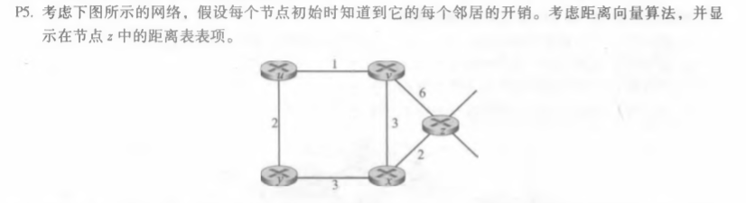
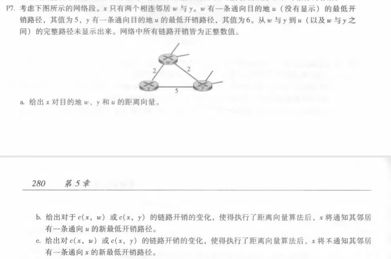

# homework9

​										*马克*

#### 计算机网络（自顶向下）中文版第五章练习（电子版p297，纸质版p279起）

###### 1,p3

答：

| step | N‘      | D(t),p(t) | D(u),p(u) | D(v),p(v) | D(w),p(w) | D(y),p(y) | D(z),p(z) |
| ---- | ------- | --------- | --------- | --------- | --------- | --------- | --------- |
| 0    | x       | ∞         | ∞         | 3,x       | 6,x       | 6,x       | 8,x       |
| 1    | xv      | 7,v       | 6,v       | 3,x       | 6,x       | 6,x       | 8,x       |
| 2    | xvu     | 7,v       | 6,v       | 3,x       | 6,x       | 6,x       | 8,x       |
| 3    | xvuw    | 7,v       | 6,v       | 3,x       | 6,x       | 6,x       | 8,x       |
| 4    | xvuwy   | 7,v       | 6,v       | 3,x       | 6,x       | 6,x       | 8,x       |
| 5    | xvuwyt  | 7,v       | 6,v       | 3,x       | 6,x       | 6,x       | 8,x       |
| 6    | xvuwytz | 7,v       | 6,v       | 3,x       | 6,x       | 6,x       | 8,x       |

###### 2,p5

| 从\到 | u    | v    | x    | y    | z    |
| ----- | ---- | ---- | ---- | ---- | ---- |
| v     | ∞    | ∞    | ∞    | ∞    | ∞    |
| x     | ∞    | ∞    | ∞    | ∞    | ∞    |
| z     | ∞    | 6    | 2    | ∞    | 0    |

| 从\到 | u    | v    | x    | y    | z    |
| ----- | ---- | ---- | ---- | ---- | ---- |
| v     | 1    | 0    | 3    | ∞    | 6    |
| x     | ∞    | 3    | 0    | 3    | 2    |
| z     | 7    | 5    | 2    | 5    | 0    |

| 从\到 | u    | v    | x    | y    | z    |
| ----- | ---- | ---- | ---- | ---- | ---- |
| v     | 1    | 0    | 3    | 3    | 5    |
| x     | 4    | 3    | 0    | 3    | 2    |
| z     | 6    |      | 2    | 5    | 0    |

###### 3，p7

a)Dx(w)=2, Dx(y)=4, Dx(u)=7

b)

（1）若c(x,y)改变，

​		（1.1)c(x,y)>=1,从x到u的最小成本路径仍为7，x不通知其邻居

​		（1.2)c(x,y)=a<=1，那么最小成本路径通过y，成本为a+6

（2）若c(x,w)改变

​		（2.1)c(x,w)=b<=1,那么u的最小成本路径通过w，成本为5+b，x将通知它的邻居

​		（2.2)c(x,w)=b>6,那么最小成本路径通过y，成本11，x将通知它的邻居这个新成本

c)链路成本c(x,y)发生变化，且c(x,y)>=1时，x不会通知它的邻居