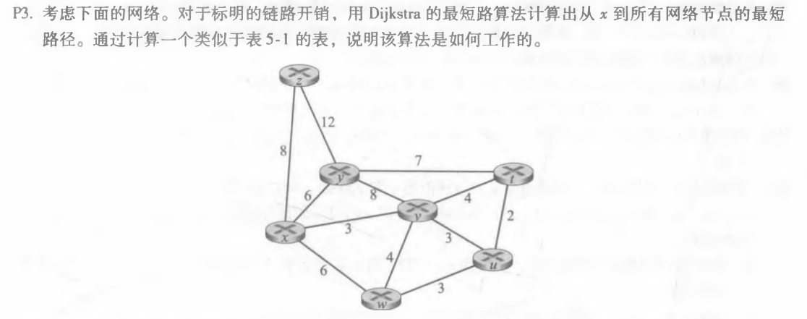
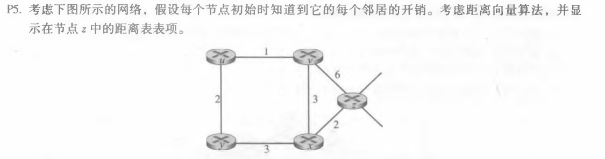
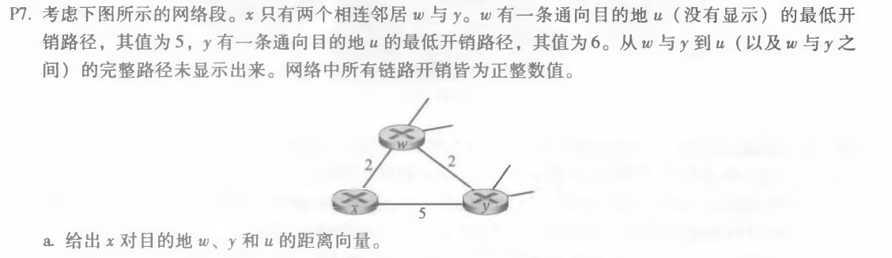
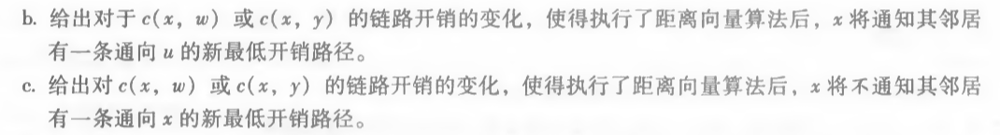

# 网络及分布式计算第九次作业

计算机学院-刁可 -2017302580031

1. P3

   

   | 步骤 | N'      | D(z), p(z) | D(y), p(y) | D(v), p(v) | D(w), p(w) | D(u), p(u) | D(t), p(t) |
   | ---- | ------- | ---------- | ---------- | ---------- | ---------- | ---------- | ---------- |
   | 0    | x       | 8, x       | 6, x       | 3, x       | 6, x       | \infty∞    | \infty∞    |
   | 1    | xv      | 8, x       | 6, x       | 3, x       | 6, x       | 6, v       | 7, v       |
   | 2    | xvy     | 8, x       | 6, x       | 3, x       | 6, x       | 6, v       | 7, v       |
   | 3    | xvyw    | 8, x       | 6, x       | 3, x       | 6, x       | 6, v       | 7, v       |
   | 4    | xvywu   | 8, x       | 6, x       | 3, x       | 6, x       | 6, v       | 7, v       |
   | 5    | xvywut  | 8, x       | 6, x       | 3, x       | 6, x       | 6, v       | 7, v       |
   | 6    | xvywutz | 8, x       | 6, x       | 3, x       | 6, x       | 6, v       | 7, v       |

2.  P5

   

   1. | From \ to | u       | v       | x       | y       | z       |
      | --------- | ------- | ------- | ------- | ------- | ------- |
      | v         | \infty∞ | \infty∞ | \infty∞ | \infty∞ | \infty∞ |
      | x         | \infty∞ | \infty∞ | \infty∞ | \infty∞ | \infty∞ |
      | z         | \infty∞ | 6       | 2       | \infty∞ | 0       |

   2. | From \ to | u       | v    | x    | y       | z    |
      | --------- | ------- | ---- | ---- | ------- | ---- |
      | v         | 1       | 0    | 3    | \infty∞ | 6    |
      | x         | \infty∞ | 3    | 0    | 3       | 2    |
      | z         | 7       | 5    | 2    | 5       | 0    |

   3. | From \ to | u    | v       | x    | y    | z    |
      | --------- | ---- | ------- | ---- | ---- | ---- |
      | v         | 1    | 0       | 3    | 3    | 5    |
      | x         | 4    | \infty∞ | 0    | 3    | 2    |
      | z         | 6    | 5       | 2    | 5    | 0    |

   4. | From \ to | u    | v    | x    | y    | z    |
      | --------- | ---- | ---- | ---- | ---- | ---- |
      | v         | 1    | 0    | 3    | 3    | 5    |
      | x         | 4    | 3    | 0    | 3    | 2    |
      | z         | 6    | 5    | 2    | 5    | 0    |
      
      
      

3.   P7

   

   

   a.  Dx(w)=2,Dx(y)=4,Dx(u)=7

   b. 对c(x,w),当c(x,w)>6,对于c(x,y),当c(x,y)＞1，有一条最低开销路径

   c. 链路成本c(x,y)变为任意值，都不会改变最低开销路径

