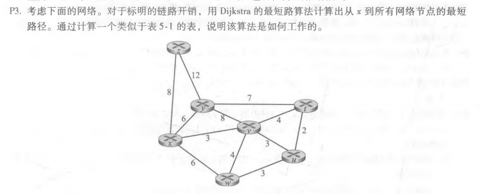
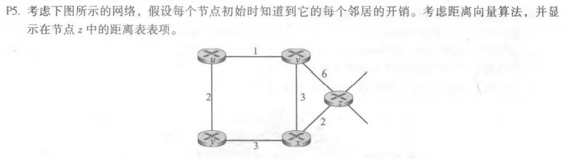
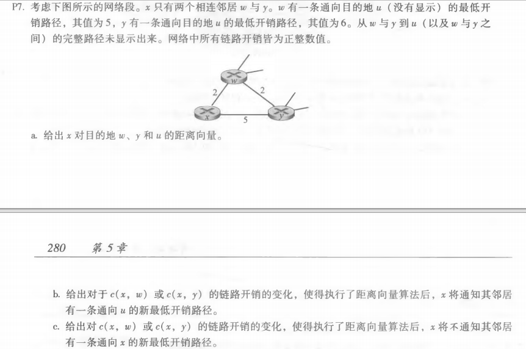

### Chapter 5：p3，p4，p5

******

| 步骤 | N'      | D(z),P(z) | D(y),P(y) | D(w),P(w) | D(v),P(v) | D(u),P(u) | D(t),P(t) |
| ---- | ------- | --------- | :-------- | --------- | --------- | --------- | --------- |
| 0    | x       | 8,x       | 6,x       | 6,x       | 3,x       | ∞         | ∞         |
| 1    | xv      | 8,x       | 6,x       | 6,x       |           | 6,v       | 7,v       |
| 2    | xvy     | 8,x       |           | 6,x       |           | 6,v       | 7,v       |
| 3    | xvyw    | 8,x       |           |           |           | 6,v       | 7,v       |
| 4    | xvywu   | 8,x       |           |           |           |           | 7,v       |
| 5    | xvywut  | 8,x       |           |           |           |           |           |
| 6    | xvywutz |           |           |           |           |           |           |

| From(z,v,x)->To(u,v,x,y,z) | u    | v    | x    | y    | z    |
| -------------------------- | ---- | ---- | ---- | ---- | ---- |
| z                          | ∞    | 6    | 2    | ∞    | 0    |
| v                          | ∞    | ∞    | ∞    | ∞    | ∞    |
| x                          | ∞    | ∞    | ∞    | ∞    | ∞    |

| From(z,v,x)->To(u,v,x,y,z) | u    | v    | x    | y    | z    |
| -------------------------- | ---- | ---- | ---- | ---- | ---- |
| z                          | 7    | 5    | 2    | 5    | 0    |
| v                          | 1    | 0    | 3    | ∞    | 6    |
| x                          | ∞    | 3    | 0    | 3    | 2    |

| From(z,v,x)->To(u,v,x,y,z) | u    | v    | x    | y    | z    |
| -------------------------- | ---- | ---- | ---- | ---- | ---- |
| z                          | 6    | 5    | 2    | 5    | 0    |
| v                          | 1    | 0    | 3    | 3    | 5    |
| x                          | 4    | 3    | 0    | 3    | 2    |

a. Dx(w) = 2, Dx(y) = 4, Dx(u) = 7

b.

- 对于c(x,y)，当c(x,y)<1时，x 将通知其邻居有一条通向 x 的新最低开销路径

- 对于c(x,w)，当c(x,w)>6时，x 将通知其邻居有一条通向 x 的新最低开销路径

c.

- 对于c(x,y)，当c(x,y)>=1时，x 将不通知其邻居有一条通向 x 的新最低开销路径

- 对于c(x,w)，当c(x,w)<=6时，x 将不通知其邻居有一条通向 x 的新最低开销路径