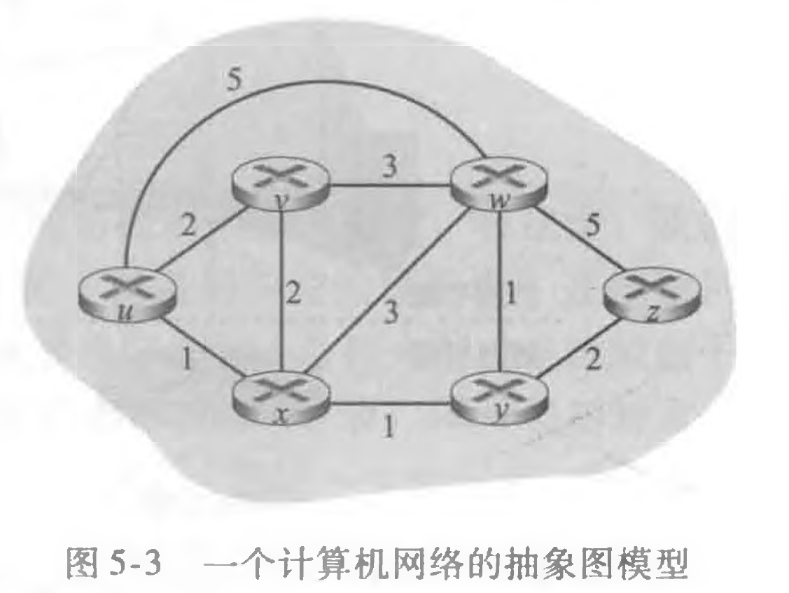
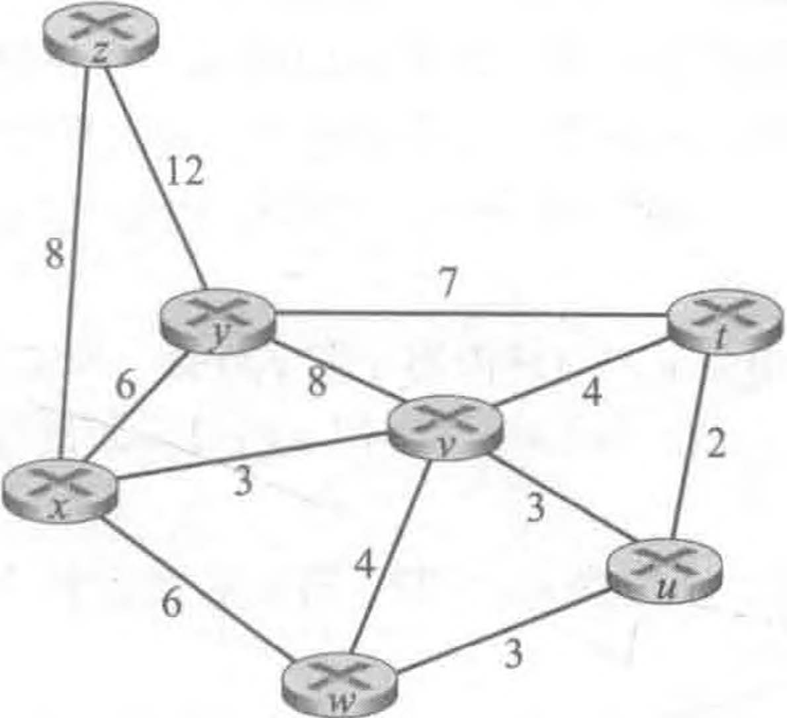
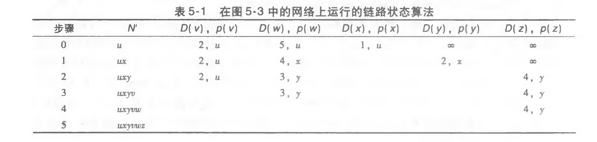

> P1.观察图5-3.列举从y到u不包含任何环路的路径。

答：从y到u不包含任何环路的路径有：
* y→x→u
* y→x→v→u
* y→x→w→u
* y→x→w→v→u

- y→w→u
- y→w→x→u
- y→w→x→v→u
- y→w→v→x→u
- y→w→v→u

+ y→z→w→u
+ y→z→w→v→u
+ y→z→w→x→u
+ y→z→w→x→v→u
+ y→z→w→v→x→u

> P2.重复习题P1，列举从x到z、z到u以及z到w的不包含任何环路的路径。

答：x到z有：
+ x→y→z
+ x→y→w→z

+ x→w→z
+ x→w→y→z

+ x→v→w→z
+ x→v→w→y→z

+ x→u→w→z
+ x→u→v→w→u→z
+ x→u→v→w→z
+ x→u→v→w→y→z

z到u有：
+ z→w→u
+ z→w→v→u
+ z→w→x→u
+ z→w→v→x→u
+ z→w→x→v→u
+ z→w→y→x→u
+ z→w→y→x→v→u

+ z→y→x→u
+ z→y→x→v→u
+ z→y→x→w→u
+ z→y→x→w→y→u
+ z→y→x→v→w→u
+ z→y→w→v→u
+ z→y→w→x→u
+ z→y→w→v→x→u
+ z→y→w→x→v→u
+ z→y→w→y→x→u
+ z→y→w→y→x→v→u

z到w有：
+ z→w

+ z→y→w
+ z→y→x→w
+ z→y→x→v→w
+ z→y→x→u→w
+ z→y→x→u→v→w
+ z→y→x→v→u→w

> P3.考虑下面的网络。对于标明的链路开销，用Dijkstra的最短路算法计算出从x到所有网络节点的最短路径。通过计算一个类似于表5-1的表，说明该算法是如何工作的。

|step|N'|D(t),p(t)|D(u),p(u)|D(v),p(v)|D(w),p(w)|D(y),p(y)|D(z),p(z)|
|-|-|-|-|-|-|-|-|
|0|x|∞|∞|3,x|6,x|6,x|8,x|
|1|xv|7,v|6,v|3,x|6,x|6,x|8,x|
|2|xvu|7,v|6,v|3,x|6,x|6,x|8,x|
|3|xvuw|7,v|6,v|3,x|6,x|6,x|8,x|
|4|xvuwy|7,v|6,v|3,x|6,x|6,x|8,x|
|5|xvuwyt|7,v|6,v|3,x|6,x|6,x|8,x|
|6|xvuwytz|7,v|6,v|3,x|6,x|6,x|8,x|
