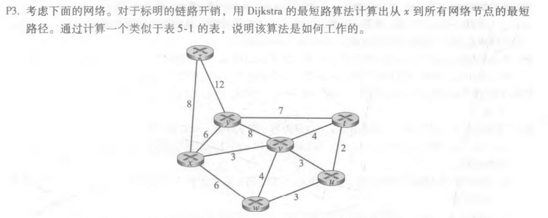
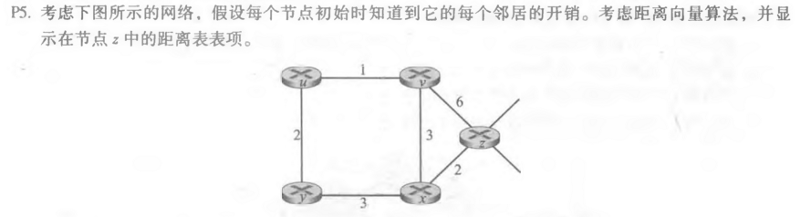
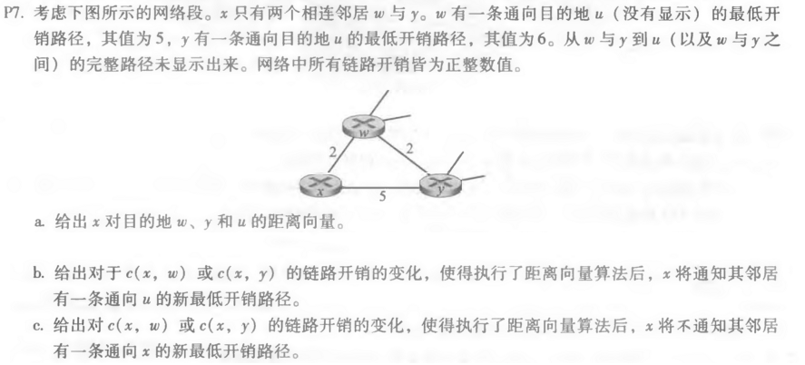

## 第9次作业

### p3


| Step | N       | D(t)P(t)       | D(u)P(u)       | D(v)P(v)       | D(w)P(w)       | D(y)P(y)       | D(z)P(z)       |
| ---- | ------- | -------------- | -------------- | -------------- | -------------- | -------------- | -------------- |
| 0    | x       | ∞              | ∞              | <u>**3,x**</u> | 6,x            | 6,x            | 8,x            |
| 1    | xv      | 7,v            | 6,v            |                | <u>**6,x**</u> | 6,x            | 8,x            |
| 2    | xvw     | 7,v            | 6,v            |                |                | <u>**6,x**</u> | 8,x            |
| 3    | xvwy    | 7,v            | <u>**6,v**</u> |                |                |                | 8,x            |
| 4    | xvwyu   | <u>**7,v**</u> |                |                |                |                | 8,x            |
| 5    | xvwyut  |                |                |                |                |                | <u>**8,x**</u> |
| 6    | xvwyutz |                |                |                |                |                |                |


### p5



从

|      | u    | v    | x    | y    | z    |
| ---- | ---- | ---- | ---- | ---- | ---- |
| v    | ∞    | ∞    | ∞    | ∞    | ∞    |
| x    | ∞    | ∞    | ∞    | ∞    | ∞    |
| z    | ∞    | 6    | 2    | ∞    | 0    |

到

|      | u    | v    | x    | y    | z    |
| ---- | ---- | ---- | ---- | ---- | ---- |
| v    | 1    | 0    | 3    | ∞    | 6    |
| x    | ∞    | 3    | 0    | 3    | 2    |
| z    | 6    | 5    | 2    | 5    | 0    |

到

|      | u    | v    | x    | y    | z    |
| ---- | ---- | ---- | ---- | ---- | ---- |
| v    | 1    | 0    | 3    | 3    | 5    |
| x    | 4    | 3    | 0    | 3    | 2    |
| z    | 6    | 5    | 2    | 5    | 0    |


### p7



a.

|      | w    | y    | u    |
| ---- | ---- | ---- | ---- |
| x    | 2    | 4    | 7    |


b.

原本的通向u地路径x到w，再从w到u，仅当

```
c(x,y)+6 < c(x,w)+5
```

x将通知邻居有一条通向u的新最低开销路径。

①当c(x,w)不变时，由此解得c(x,y)<1

②当c(x,y)不变时，由此解得c(x,w)>5


c.

①当c(x,w)不变时，c(x,y) ≥ 1

②当c(x,y)不变时，c(x,w) ≤ 5