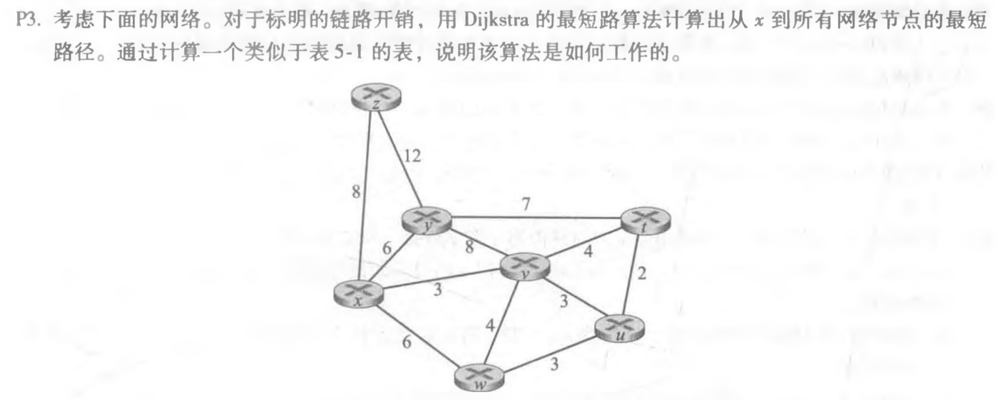
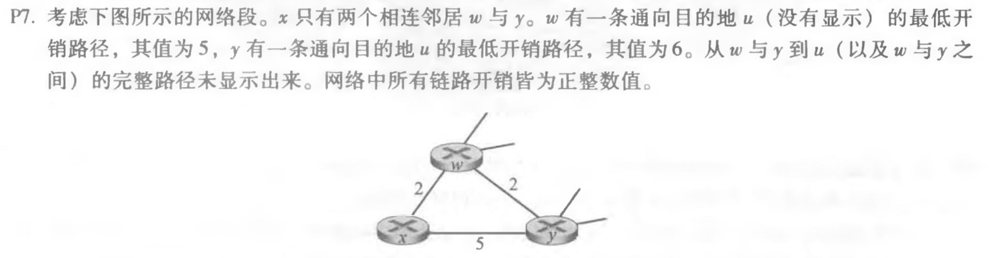

## 第五章习题

| 步骤 | N'     | D(y),P(y) | D(z),P(z) | D(v),P(v) | D(w),P(w) | D(t),P(t) | D(u),P(u) |
| ---- | ------ | --------- | --------- | --------- | --------- | --------- | --------- |
| 0    | x      | 6,x       | 8,x       | 3,x       | 6,x       | ∞         | ∞         |
| 1    | xv     | 6,x       | 8,x       |           | 6,x       | 7,v       | 6,v       |
| 2    | xvu    | 6,x       | 8,x       |           | 6,x       | 7,v       |           |
| 3    | xvuy   |           | 8,x       |           | 6,x       | 7,v       |           |
| 4    | xvuyw  |           | 8,x       |           |           | 7,v       |           |
| 5    | xvuyw  |           | 8,x       |           |           |           |           |
| 6    | xvuywz |           |           |           |           |           |           |

|      | z    | x    | v    | u    | y    |
| ---- | ---- | ---- | ---- | ---- | ---- |
| z    | 0    | 2    | 6    | ∞    | ∞    |
| x    | 2    | 0    | 3    | ∞    | 3    |
| v    | 6    | 3    | 0    | 1    | ∞    |

|      | z    | x    | v    | u    | y    |
| ---- | ---- | ---- | ---- | ---- | ---- |
| z    | 0    | 2    | 5    | 7    | 5    |
| x    | 2    | 0    | 3    | ∞    | 3    |
| v    | 6    | 3    | 0    | 1    | ∞    |

|      | z    | x    | v    | u    | y    |
| ---- | ---- | ---- | ---- | ---- | ---- |
| z    | 0    | 2    | 5    | 7    | 5    |
| x    | 2    | 0    | 3    | 4    | 3    |
| v    | 5    | 3    | 0    | 1    | 3    |

|      | z    | x    | v    | u    | y    |
| ---- | ---- | ---- | ---- | ---- | ---- |
| z    | 0    | 2    | 5    | 7    | 5    |
| x    | 2    | 0    | 3    | 4    | 3    |
| v    | 5    | 3    | 0    | 1    | 3    |

> a. 给出x对目的地w、y和u的距离向量

Dx(w) = 2

Dx(y) = min{c(x,w)+Dw(y),c(x,y)+Dy(y)} = 4

Dx(u) = min{c(x,w)+Dw(u),c(x,y)+Dy(u)} = 7

> b. 给出对于c(x, w)或c(x, y)的链路开销的变化，使得执行了距离向量算法后，x将通知其邻居
>
> 有一条通向u的新最低开销路径。

变化：

c(x,w) = 10

c(x,y) = 1

> c. 给出对c(x, w)或c(x,y)的链路开销的变化，使得执行了距离向量算法后，力将不通知其邻居
>
> 有一条通向x 的新最低开销路径。

变化：

1. c(x,w) = 3

2. c(x,y) = 3