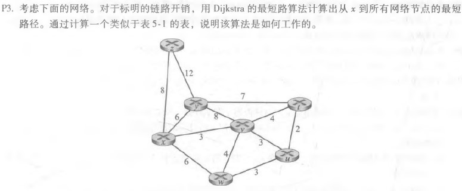

# 网络及分布式计算作业（九）

[toc]

```html
<script type="text/javascript" src="http://cdn.mathjax.org/mathjax/latest/MathJax.js?config=TeX-AMS-MML_HTMLorMML"></script>
<script type="text/x-mathjax-config">
    MathJax.Hub.Config({ tex2jax: {inlineMath: [['$', '$']]}, messageStyle: "none" });
</script>
```
## 课后习题

### p3



| 步骤 |   N'    | D(y), P(y) | D(z), P(z) | D(u), P(u) | D(v), P(v) | D(w), P(w) | D(t), P(t) |
| :--: | :-----: | ---------- | :--------: | :--------: | :--------: | :--------: | :--------: |
|  0   |    x    | 6,x        |    8,x     |  $\infty$  |    3,x     |    6，x    |  $\infty$  |
|  1   |   xv    | 6,x        |    8,x     |    6,v     |            |    6，x    |    7,v     |
|  2   |   xvy   |            |    8,x     |    6,v     |            |    6，x    |    7,v     |
|  3   |  xvyu   |            |    8,x     |            |            |    6，x    |    7,v     |
|  4   |  xvyuw  |            |    8,x     |            |            |            |    7,v     |
|  5   | xvyuwt  |            |     8x     |            |            |            |            |
|  6   | xvyuwtz |            |            |            |            |            |            |

Dijkstra算法执行过程如下

1. 将起点放入节点集N'；

2. 对每一个不在N‘中顶点v：遍历N'中的每一个顶点w，计算图中各个顶点v到起点的当前最短距离D(v)，并记录路径的前导节点

   D(v)=min(D(v), D(w)+c(w,v))

3. 选择不在N‘中顶点中D(v)最小的点加入N'；

4. 若图中所有点都在N'中，算法结束；否则返回 2。

### P5


|      |      |          |          | 到......的开销 |          |          |
| ---- | ---- | -------- | -------- | -------------- | -------- | -------- |
|      |      | x        | y        | z              | u        | v        |
|      | x    | $\infty$ | $\infty$ | $\infty$       | $\infty$ | $\infty$ |
| 从   | z    | 6        | $\infty$ | 0              | $\infty$ | 6        |
|      | v    | $\infty$ | $\infty$ | $\infty$       | $\infty$ | $\infty$ |


|      |      |      |          | 到......的开销 |          |      |
| ---- | ---- | ---- | -------- | -------------- | -------- | ---- |
|      |      | x    | y        | z              | u        | v    |
|      | x    | 0    | 3        | 2              | $\infty$ | 3    |
| 从   | z    | 2    | 5        | 0              | 6        | 5    |
|      | v    | 3    | $\infty$ | 5              | 1        | 0    |


|      |      |      |      | 到......的开销 |      |      |
| ---- | ---- | ---- | ---- | -------------- | ---- | ---- |
|      |      | x    | y    | z              | u    | v    |
|      | x    | 0    | 3    | 2              | 4    | 3    |
| 从   | z    | 2    | 5    | 0              | 6    | 5    |
|      | v    | 3    | 3    | 5              | 1    | 0    |


|      |      |      |      | 到......的开销 |      |      |
| ---- | ---- | ---- | ---- | -------------- | ---- | ---- |
|      |      | x    | y    | z              | u    | v    |
|      | x    | 0    | 3    | 2              | 4    | 3    |
| 从   | z    | 2    | 5    | 0              | 6    | 5    |
|      | v    | 3    | 3    | 5              | 1    | 0    |

### P9


不会，这是因为降低链路成本不会导致循环(由该链路的两个节点之间的下一跳关系引起)。

将两个节点连接到一个链路相当于将链路负载从无限降到有限，会发生与链路成本下降类似的变化。

