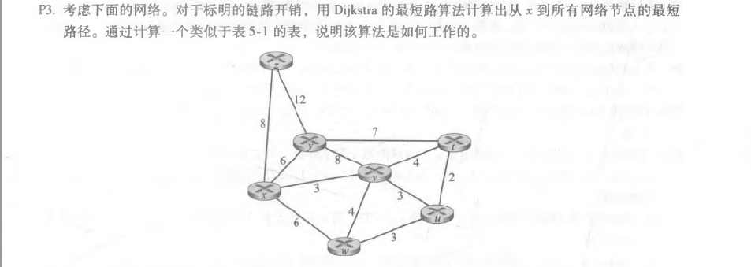
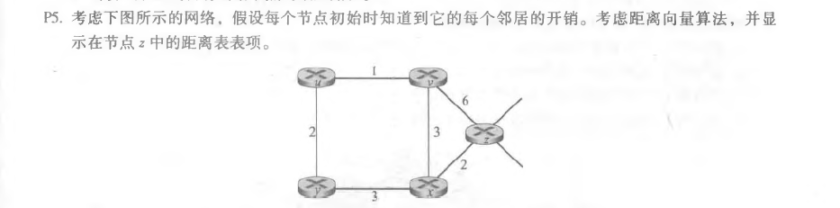

## Homework_9

**Author：**

姓名： 王泽生

学号：2017302580268

第五章习题：**P3、P5、P9**

### P3

**解答：**

| 步骤 | N'      | D(y), p(y) | D(z), p(z) | D(v), p(v) | D(w), p(w) | D(u), p(u) | D(t), p(t) |
| ---- | ------- | ---------- | ---------- | ---------- | ---------- | ---------- | ---------- |
| 0    | x       | 6, x       | 8, x       | 3, x       | 6, x       | $\infty$   | $\infty$   |
| 1    | xv      | 6, x       | 8, x       | 3, x       | 6, x       | 6, v       | 7, v       |
| 2    | xvy     | 6, x       | 8, x       | 3, x       | 6, x       | 6, v       | 7, v       |
| 3    | xvyw    | 6, x       | 8, x       | 3, x       | 6, x       | 6, v       | 7, v       |
| 4    | xvywu   | 6, x       | 8, x       | 3, x       | 6, x       | 6, v       | 7, v       |
| 5    | xvywut  | 6, x       | 8, x       | 3, x       | 6, x       | 6, v       | 7, v       |
| 6    | xvywutz | 6, x       | 8, x       | 3, x       | 6, x       | 6, v       | 7, v       |

### P5

**解答：**

1-->

| ->   | z        | x        | v        | y        | u        |
| ---- | -------- | -------- | -------- | -------- | -------- |
| z    | 0        | 2        | 6        | $\infty$ | $\infty$ |
| v    | $\infty$ | $\infty$ | $\infty$ | $\infty$ | $\infty$ |
| x    | $\infty$ | $\infty$ | $\infty$ | $\infty$ | $\infty$ |

2-->

| ->   | z    | x    | v    | y        | u        |
| ---- | ---- | ---- | ---- | -------- | -------- |
| z    | 0    | 2    | 5    | 5        | 7        |
| v    | 6    | 3    | 0    | $\infty$ | 1        |
| x    | 2    | 0    | 3    | 3        | $\infty$ |

3-->

| ->   | z    | x    | v    | y    | u    |
| ---- | ---- | ---- | ---- | ---- | ---- |
| z    | 0    | 2    | 5    | 5    | 6    |
| v    | 5    | 3    | 0    | 3    | 1    |
| x    | 2    | 0    | 3    | 3    | 4    |

4-->

| ->   | z    | x    | v    | y    | u    |
| ---- | ---- | ---- | ---- | ---- | ---- |
| z    | 0    | 2    | 5    | 5    | 6    |
| v    | 5    | 3    | 0    | 3    | 1    |
| x    | 2    | 0    | 3    | 3    | 4    |

### P9

**解答：**

不会出现无穷计数问题。

这是因为降低链路成本不会导致循环(由该链路的两个节点之间的下一跳关系引起)。将两个节点连接到一个链路相当于将链路权重从无限降到有限。 

