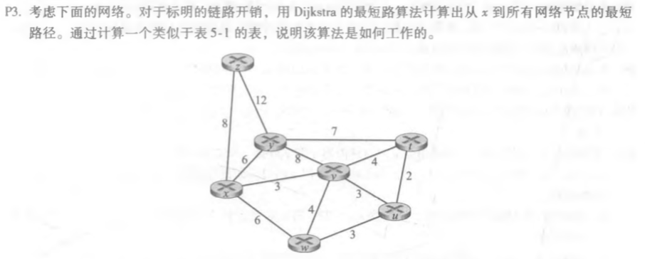
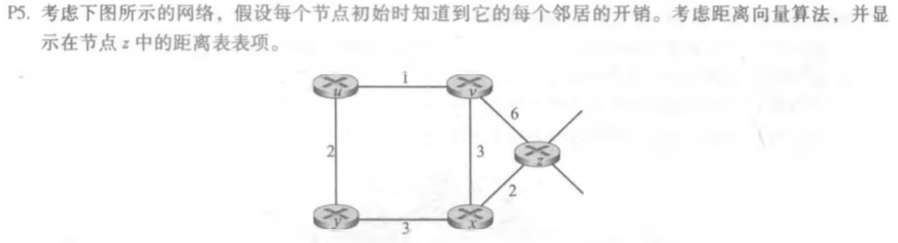
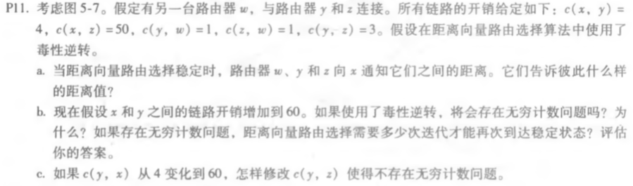

### P3

| 步骤 | N‘      | D(y),p(y) | D(z),p(z) | D(w),p(w) | D(v),p(v) | D(t),p(t) | D(u),p(u) |
| ---- | ------- | --------- | --------- | --------- | --------- | --------- | --------- |
| 0    | x       | 6,x       | 8,x       | 6,x       | 3,x       | inf       | inf       |
| 1    | xv      | 6,x       | 8,x       | 6,x       |           | 7,v       | 6,u       |
| 2    | xvy     |           | 8,x       | 6,x       |           | 7,v       | 6,u       |
| 3    | xvyw    |           | 8,x       |           |           | 7,v       | 6,u       |
| 4    | xvywu   |           | 8,x       |           |           | 7,v       |           |
| 5    | xvywut  |           | 8,x       |           |           |           |           |
| 6    | xvywutz |           |           |           |           |           |           |

### P5

| From/To | z    | x    | v    | u    | y    |
| ------- | ---- | ---- | ---- | ---- | ---- |
| z       | 0    | 2    | 6    | inf  | inf  |
| x       | inf  | inf  | inf  | inf  | inf  |
| v       | inf  | inf  | inf  | inf  | inf  |

| From/To | z    | x    | v    | u    | y    |
| ------- | ---- | ---- | ---- | ---- | ---- |
| z       | 0    | 2    | 5    | 7    | 5    |
| x       | 2    | 0    | 3    | inf  | 3    |
| v       | 6    | 3    | 0    | 1    | inf  |

| From/To | z    | x    | v    | u    | y    |
| ------- | ---- | ---- | ---- | ---- | ---- |
| z       | 0    | 2    | 5    | 6    | 5    |
| x       | 2    | 0    | 3    | 4    | 3    |
| v       | 5    | 3    | 0    | 1    | 3    |

| From/To | z    | x    | v    | u    | y    |
| ------- | ---- | ---- | ---- | ---- | ---- |
| z       | 0    | 2    | 5    | 6    | 5    |
| x       | 2    | 0    | 3    | 4    | 3    |
| v       | 5    | 3    | 0    | 1    | 3    |

### P11

a 

| From | To   | D(x) |
| ---- | ---- | ---- |
| w    | y    | inf  |
| w    | z    | 5    |
| y    | w    | 4    |
| y    | z    | 4    |
| z    | w    | 6    |
| z    | y    | inf  |

b. 会存在无穷计数问题

| time | t0                       | t1                       | t2                       | t3                       | t4                       |
| ---- | ------------------------ | ------------------------ | ------------------------ | ------------------------ | ------------------------ |
| z    | ->w Dz(x)=inf |                          |                          | ->w Dz(x)=inf |                          |
| z    | ->y Dz(x)=6   |                          |                          | ->y Dz(x)=11  |                          |
| w    | ->y Dw(x)=inf |                          | ->y Dw(x)=inf |                          |                          |
| w    | ->z Dw(x)=5   |                          | ->z Dw(x)=10  |                          |                          |
| y    | ->w Dy(x)=4   | ->w Dy(x)=9   |                          |                          | ->w Dy(x)=14  |
| y    | ->z Dy(x)=4   | ->z Dy(x)=inf |                          |                          | ->z Dy(x)=inf |

根据计算到x的开销从t1-t4可以发现这是一个循环,每个循环过后Dy(x)的值增加5,依次类推可以知道:

在t为25时Dy(x)的值为49,此时y告诉w Dy(x)=49;告诉z Dy(x)=inf.

在t为26时w告诉y Dw(x)=inf;告诉z Dw(x)=50;

在t为27时z告诉w Dz(x)=50;告诉y Dz(x)=50;

在t为28时w告诉z Dw(x)=50;告诉y Dw(x)=inf;    y告诉w Dy(x)=53;告诉z Dy(x)=inf

在t为29时z告诉w Dz(x)=50;告诉y Dz(x)=50;   w告诉z Dw(x)=inf;告诉y Dw(x)=51;  

在t为30时y告诉w Dy(x)=inf;告诉z Dy(x)=52;

在t为31时都保持不变了

c 

c(y,z)=inf直接断开

