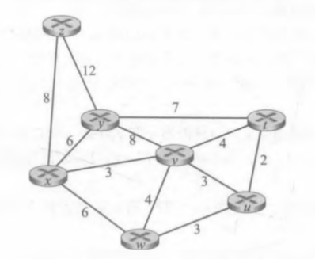
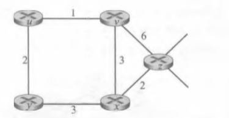
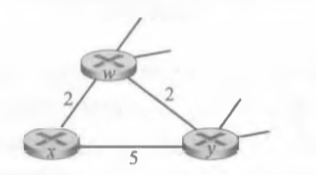

# HOMEWORK9

2017302580288  李沛昊

## P3

**问题：**考虑下面的网络。对于标明的链路开销，用Dijkstra的最短路算法计算出从$x$到所有网络节点的最短 路径。通过计算一个类似于表5・1的表，说明该算法是如何工作的。

**解答：**

| 步骤 | $N'$      | $D(v),p(v)$ | $D(y),p(y)$ | $D(w),p(w)$ | $D(z),p(z)$ | $D(u),p(u)$ | $D(t),p(t)$ |
| ---- | --------- | ----------- | ----------- | ----------- | ----------- | ----------- | ----------- |
| 0    | $x$       | 3,$x$       | 6,$x$       | 6,$x$       | 8,$x$       | $\infty$    | $\infty$    |
| 1    | $xv$      |             | 6,$x$       | 6,$x$       | 8,$x$       | 6,$v$       | 7,$v$       |
| 2    | $xvu$     |             | 6,$x$       | 6,$x$       | 8,$x$       |             | 7,$v$       |
| 3    | $xvuy$    |             |             | 6,$x$       | 8,$x$       |             | 7,$v$       |
| 4    | $xvuyw$   |             |             |             | 8,$x$       |             | 7,$v$       |
| 5    | $xvuywt$  |             |             |             | 8,$x$       |             |             |
| 6    | $xvuywtz$ |             |             |             |             |             |             |

## P5

**问题：**考虑下图所示的网络，假设每个节点初始时知道到它的每个邻居的开销。考虑距离向量算法，并显 示在节点z中的距离表表项。

**解答：**

初始：

|      | $x$      | $y$      | $z$      | $u$      | $v$      |
| ---- | -------- | -------- | -------- | -------- | -------- |
| $x$  | $\infty$ | $\infty$ | $\infty$ | $\infty$ | $\infty$ |
| $v$  | $\infty$ | $\infty$ | $\infty$ | $\infty$ | $\infty$ |
| $z$  | 2        | $\infty$ | 0        | $\infty$ | 6        |

|      | $x$  | $y$      | $z$  | $u$      | $v$  |
| ---- | ---- | -------- | ---- | -------- | ---- |
| $x$  | 0    | 3        | 2    | $\infty$ | 3    |
| $v$  | 3    | $\infty$ | 6    | 1        | 0    |
| $z$  | 2    | 5        | 0    | 7        | 5    |

|      | $x$  | $y$  | $z$  | $u$  | $v$  |
| ---- | ---- | ---- | ---- | ---- | ---- |
| $x$  | 0    | 3    | 2    | 4    | 3    |
| $v$  | 3    | 3    | 5    | 1    | 0    |
| $z$  | 2    | 5    | 0    | 6    | 5    |

|      | $x$  | $y$  | $z$  | $u$  | $v$  |
| ---- | ---- | ---- | ---- | ---- | ---- |
| $x$  | 0    | 3    | 2    | 4    | 3    |
| $v$  | 3    | 3    | 5    | 1    | 0    |
| $z$  | 2    | 5    | 0    | 6    | 5    |

## P7

**问题：**考虑下图所示的网络段。x只有两个相连邻居w与y。w有一条通向目的地u（没有显示）的最低开 销路径，其值为5, y有一条通向目的地u的最低开销路径，其值为6。从如w与y到u （以及w与y之 间）的完整路径未显示出来。网络中所有链路开销皆为正整数值。

a-给出x对目的地$w$、y和u的距离向量

b. 给出对于c(x, w)或c(x, y)的链路开销的变化，使得执行了距离向量算法后，x将通知其邻居 有一条通向u的新最低开销路径。

c. 给出对c(x, w)或c(x, y)的链路开销的变化，使得执行了距离向量算法后，x将不通知其邻居 有一条通向u的新最低开销路径。 

**解答：**

a.$D_{x}(w)=2,D_{x}(y)=4,D_{x}(u)=7$

b.任何$c(x,w)$的改动都会产生新的通向u的新最低开销路径

​	当$c(x,w)>6$时，x将告诉邻居通向u的新最低开销路径为x->y->u

​	当$c(x,w)<=6$时，x将告诉邻居通向u的新最低开销为5+c(x,w)

c.任何对c(x,y)的改变，都不会引起x到u最低路径的改变