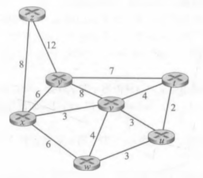
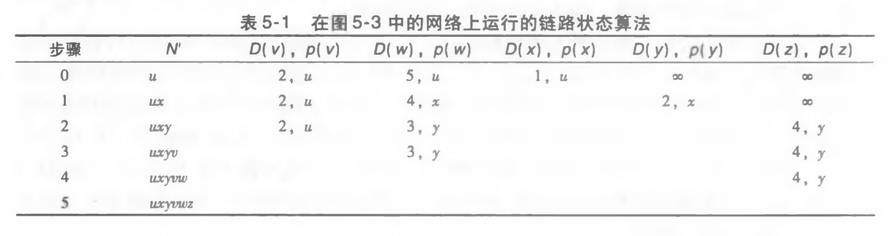
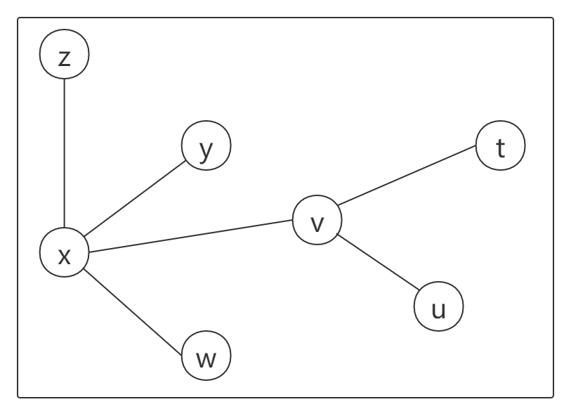
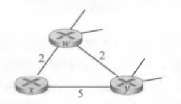
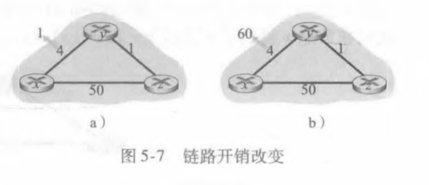

# Homework9

---

## 个人信息

- 班级：软工六班
- 学号：2017302580291
- 姓名：洪龙熙

---

## 作业

### 作业1

- 题目

> P3
>
> 考虑下面的网络。
>
> 
>
> 对于标明的链路开销，用 Dijkstra 的最短路算法计算出从 x 到所有网络节点的最短路径。通过计算一个类似于表5-1的表，说明该算法是如何工作的。

-   答案

    表5-1如下：

    
    
	| Step | N'      | D(z), p(z) | D(y), p(y) | D(w), p(w) | D(v), p(v) | D(t), p(t) | D(u), p(u) |
    | ---- | ------- | ---------- | ---------- | ---------- | ---------- | ---------- | ---------- |
    | 0    | x       | 8, x       | 6, x       | 6, x       | 3, x       | ∞          | ∞          |
    | 1    | xv      | 8, x       | 6, x       | 6, x       |            | 7, v       | 6, v       |
    | 2    | xvy     | 8, x       |            | 6, x       |            | 7, v       | 6, v       |
    | 3    | xvyw    | 8, x       |            |            |            | 7, v       | 6, v       |
    | 4    | xvywu   | 8, x       |            |            |            | 7, v       |            |
    | 5    | xvywut  | 8, x       |            |            |            |            |            |
    | 6    | xvywutz |            |            |            |            |            |            |
    
    可得，路径为：
    
    -   z 连接 x
    -   t 连接 v
    -   u 连接 v
    -   w 连接 x
    -   y 连接 x
    -   v 连接 x
    
    	

### 作业2

- 题目

> P7
>
> 考虑下图所示的网络段。
>
> 
>
> x 只有两个相连邻居 w 与 y。w 有一条通向目的地 u（没有显示）的最低开销路径，其值为 5，y 有一条通向目的地 u 的最低开销路径，其值为6。从 w 与 y 到 u（以及 w 与 y 之间）的完整路径未显示出来。网络中所有链路开销皆为正整数值。
>
> 1.  给出 x 对目的地 w、y 和 u 的距离向量。
> 2.   给出对于 c(x, w) 或 c(x, y) 的链路开销的变化，使得执行了距离向量算法后，x 将通知其邻居有一条通向 u 的新最低开销路径。
> 3.  给出对 c(x, w) 或 c(x, y) 的链路开销的变化，使得执行了距离向量算法后，x 将不通知其邻居有一条通向 x 的新最低开销路径。  

-   答案
    1.  $D_x(w) = 2$

        $D_x(y) = \min(4, 5) = 4$

        $D_x(u) = \min(7, 10) = 7$

    2.  若 c(x, y) 变化，则需要始得 $c(x, y) + c(y, u) < D_x(u)$，即 $c(x, y) < 1$，不成立 

        若 c(x, w) 变化，则 $c(x,w) + c(w, u) < D_x(u)$，即 $c(x, w) < 2$，成立

        故，c(x, w) = 1时，将通知。

    3.  若 c(x, y) 变化，则需要始得 $c(x, y) + c(y, u) \ge D_x(u)$，即 $c(x, y) \ge 1$，永久成立 

        若 c(x, w) 变化，则 $c(x,w) + c(w, u) \ge D_x(u)$，即 $c(x, w) \ge 2$，当 c(x, w) 变为大于 2 的开销时，不会通知

        故，c(x, w) 变为大于 2 的开销，或 c(x, y) 任意变化时，将不通知。

### 作业3

- 题目

> P11
>
> 考虑图5-7。
>
> 
>
> 假定有另一台路由器 w，与路由器 y 和 z 连接。所有链路的开销给定如下：c(x, y) = 4, c(x, z) = 50, c(y, w) = 1, c(z, w) = 1, c(y, z) = 3。假设在距离向量路由选择算法中使用了毒性逆转。如下图：
>
> 
>
> 1.  当距离向量路由选择稳定时，路由器 w、y 和 z 向 x 通知它们之间的距离。它们告诉彼此什么样的距离值？
> 2.  现在假设 x 和 y 之间的链路开销增加到 60。如果使用了毒性逆转，将会存在无穷计数问题吗？为什么？如果存在无穷计数问题，距离向量路由选择需要多少次迭代才能再次到达稳定状态？评估你的答案。 
> 3.  如果 c(y, x) 从 4 变化到 60，怎样修改 c(y, z) 使得不存在无穷计数问题。 

-   答案
    1.  路由器 w：$D_w(z) = 1$，$D_w(y) = 1$

        ​				  通知 z，$D_w(x) = 5$

        ​				  通知 y，$D_w(x) = \infty$

        路由器 y：$D_y(w) = 1$，$D_y(z) = 2$

        ​				  通知 z，$D_y(x) = 4$

        ​				  通知 w，$D_y(x) = 4$

        路由器 z：$D_z(y) = 2$，$D_z(w) = 1$

        ​				  通知 y，$D_z(x) = 6$

        ​				  通知 w，$D_z(x) = \infty$

        为什么是$\infty$呢？

        例如路由器 w，因为 $D_w(x) = 5$，w 的下一个目标是 y，所以如果告诉路由器 y，可能会让 y 选择传给 w，而 w 又传给 y，可能陷入循环，所以告诉要经过的路由器的值为$\infty$

        而路由器 z，虽然 $D_z(x) = 6$ 会经过 y，但 y 不是 z 的下一个目标，所以可以告诉 y

    2.  c(x, y) = 60，会出现无穷计数问题。

        

        计算过程如下：

        

        | T    | t~1~                   | t~2~                 | t~3~                 | t~4~                 |
        | ---- | ---------------------- | -------------------- | -------------------- | -------------------- |
        | w    |                        | →y，$\infty$；→z，10 |                      | 因$\infty$故不变     |
        | y    | →w，$9$ ；→z，$\infty$ |                      | 因$\infty$故不变     | →w：14；→z：$\infty$ |
        | z    |                        | 因$\infty$故不变     | →w：$\infty$；→y：11 |                      |

        可见，t~4~ 和 t~1~ 一样，都是 y 变化，且发送信息都是发给 w 具体数值，发给 z $\infty$，所以这是一个循环，至少逼近 52

        所以，经计算，于 t~25~ 时，情况为：

        | T    | t~25~                | t~26~                | t~27~            | t~28~                  |
        | ---- | -------------------- | -------------------- | ---------------- | ---------------------- |
        | w    |                      | →y，$\infty$；→z，50 |                  | 经计算仍然是50，不变   |
        | y    | →w：49；→z：$\infty$ |                      | 因$\infty$故不变 | →w：$53$；→z：$\infty$ |
        | z    |                      | 因$\infty$故不变     | →w，$50$；→y，50 |                        |

        | T    | t~29~                | t~30~                  | t~31~            |
        | ---- | -------------------- | ---------------------- | ---------------- |
        | w    | →y，51；→z，$\infty$ |                        | 因$\infty$故不变 |
        | y    |                      | →w，$\infty$；→z，$52$ |                  |
        | z    | 因$\infty$故不变     | 因$\infty$故不变       | 经计算，不变     |

        计算如下：

        

        综上，需要31次。

    3.  c(y, z) > 39即可，在 t~4~ 时就会通告其他路由器 D~z~(x) = 50，而非 14