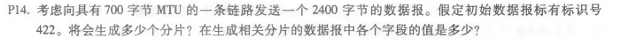
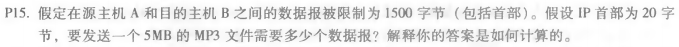
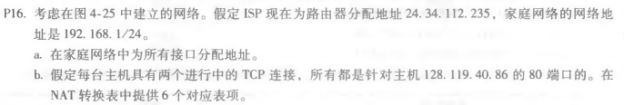

# 第八次作业
## 刘洋 2017302580294
P14: 
因为IP的报头为20字节,每个片段中数据字段的最大大小=680字节。 
因此，所需的片段数为：（2400-20）/680 = 3.5。 
所以需要四个片段。 
每个片段将具有识别号422。最后一个数据报的大小为360字节，其他片段的数据报大小为700个字节。 
这4个片段的偏移量为0，85，170，255。 
前三个片段中的每一个都有标志=1；最后一个片段将有标志=0。

P15: 
5MB = 5 * 1024 * 1024 = 5242880字节 
如果数据是在TCP中携带，每个TCP也有20字节的表头，所以 
每个数据报可携带数据大小为：1500 - 40 = 1460字节 
需要的数据报为：5242880 / 1460 = 3591.0137次 
所以需要3592个数据报。 

P16: 
(a)、家庭地址：192.168.1.1、192.168.1.2、192.168.1.3 
路由器接口为：192.168.1.4 
(b)、WAN Side&emsp;&emsp;&emsp;&emsp;&emsp;&emsp;&emsp;LAN Side 
24.34.112.235, 4000	&emsp;&emsp;192.168.1.1, 3345 
24.34.112.235, 4001	&emsp;&emsp;192.168.1.1, 3346 
24.34.112.235, 4002	&emsp;&emsp;192.168.1.2, 3445 
24.34.112.235, 4003	&emsp;&emsp;192.168.1.2, 3446 
24.34.112.235, 4004	&emsp;&emsp;192.168.1.3, 3545 
24.34.112.235, 4005	&emsp;&emsp;192.168.1.3, 3546 