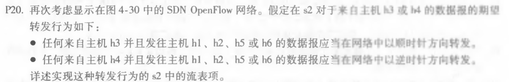
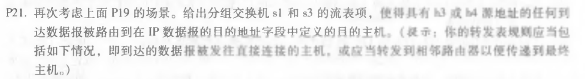

#### 1. P19

因为来自主机 h5 或 h6 可以用 IP Src = 10.3.\*.\*表示；

发往主机 h1 或 h2 可以用 IP Dst = 10.1.\*.\*表示；

发往主机 h3 或 h4 可以用 IP Dst = 10.2.\*.\*表示；

通过输出端口 i 使用 Forward(i) 表示；

转发到端口 i 使用 Ingress Port = i 表示；

主机 h3 和 h4 共用一台交换机，因此彼此发送数据包不需要携带 IP Src 和 IP Dst，指明输出和转发端口即可；

因此 s2 中流表项为：

| 匹配                                                       | 动作       |
| ---------------------------------------------------------- | ---------- |
| IP Src = 10.3.\*.\*; IP Dst = 10.2.\*.\*; Ingress Port = 1 | Forward(2) |
| IP Src = 10.1.\*.\*; IP Dst = 10.3.\*.\*; Ingress Port = 2 | Forward(1) |
| IP Dst = 10.2.0.3; Ingress Port = 1                        | Forward(3) |
| IP Dst = 10.2.0.3; Ingress Port = 2                        | Forward(3) |
| IP Dst = 10.2.0.4; Ingress Port = 1                        | Forward(4) |
| IP Dst = 10.2.0.4; Ingress Port = 2                        | Forward(4) |
| Ingress Port = 3                                           | Forward(4) |
| Ingress Port = 4                                           | Forward(3) |

#### 2. P20

来自主机 h3 发往主机 h1、h2、h5或者h6，为保证数据报以顺时针方向转发，应该转发到端口3，从端口2输出；

来自主机 h4 发往主机 h1、h2、h5或者h6，为保证数据报以逆时针方向转发，应该转发到端口4，从端口1输出；

因此 s2 中流表项为：

| 匹配                                  | 动作       |
| ------------------------------------- | ---------- |
| IP Dst = 10.1.\*.\*; Ingress Port = 3 | Forward(2) |
| IP Dst = 10.3.\*.\*; Ingress Port = 3 | Forward(2) |
| IP Dst = 10.1.\*.\*; Ingress Port = 4 | Forward(1) |
| IP Dst = 10.3.\*.\*; Ingress Port = 4 | Forward(1) |

#### 3. P21

对于s1:

为使得具有 h3 或 h4 源地址的任何到达数据包被路由到IP数据报的目的地址字段中定义的目标主机。

当到达的数据包被发往直接连接的主机时，对于主机 h1, 应该从从端口2输出；对于主机 h2，应该从端口3输出

当转发到相邻路由器时，因为是顺时针方向传输，则应该从s2 转发到 s3，从端口4转发，端口1输出；

因此 s1 中流表项为：

| 匹配                                     | 动作       |
| ---------------------------------------- | ---------- |
| IP Src = 10.2.\*.\*; IP Dst = 10.1.0.1   | Forward(2) |
| IP Src = 10.2.\*.\*; IP Dst = 10.1.0.2   | Forward(3) |
| IP Src = 10.2.\*.\*; IP Dst = 10.3.\*.\* | Forward(1) |

同理对于s3:

为使得具有 h3 或 h4 源地址的任何到达数据包被路由到IP数据报的目的地址字段中定义的目标主机。

当到达的数据包被发往直接连接的主机时，对于主机 h5, 应该从从端口2输出；对于主机 h6，应该从端口1输出

当转发到相邻路由器时，因为是逆时针方向传输，则应该从s2 转发到 s1，从端口4转发，端口3输出；

因此 s3 中流表项为：

| 匹配                                     | 动作       |
| ---------------------------------------- | ---------- |
| IP Src = 10.2.\*.\*; IP Dst = 10.3.0.5   | Forward(2) |
| IP Src = 10.2.\*.\*; IP Dst = 10.3.0.6   | Forward(1) |
| IP Src = 10.2.\*.\*; IP Dst = 10.1.\*.\* | Forward(3) |

