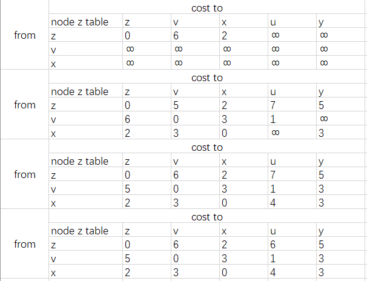

# HOMEWORK_8
- P3  
    |步骤|N'|D(v),p(v)|D(z),p(z)|D(y),p(y)|D(w),p(w)|D(u),p(u)|D(t),p(t)|
  -|-|-|-|-|-|-|-|
  |0|x|3, x|8, x|6, x|6, x|∞|∞|
  |1|xv| |8, x|6, x|6, x| 6, v|7, v|
  |2|xvu| |8, x|6, x|6, x| |7, v|
  |3|xvuy| |8, x ||6, x| |7, v |
  |4|xvuyw| |8, x | | | | 7, v |
  |4|xvuywt| |8, x | | | | |
  |4|xvuywtz| | | | | | |
  x到v：x-v，3  
  x到z：x-z，8  
  x到y：x-y，6  
  x到w：x-w，6  
  x到u：x-v-u，6  
  x到t：x-v-t，7  
  算法工作原理：以x为源点，分别计算到各点的开销，如果不能直接到达则设置为∞。然后选取开销最小的点加入节点子集N'，然后在计算到各点开销，如果新加入点到某点的开销+源点到新加入点开销<源点到某点的开销，则替换开销，更新表。重复迭代，直到所有点加入N'。
- P5  
  
  
- P6  
  一个节点与其邻居交换其距离并接受它们的距离向量，意思在一次迭代后就可计算出到邻居的其他邻居的距离。设网络没有环路的最长路径为d，那么在d-1次迭代后可收敛。如果跳数（迭代次数）大于d则必为循环，所以算法d-1次可收敛。如果网络动态变化，除非指明链路成本界限，否则最大迭代次数趋向无穷。