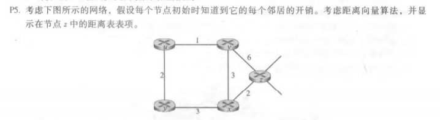
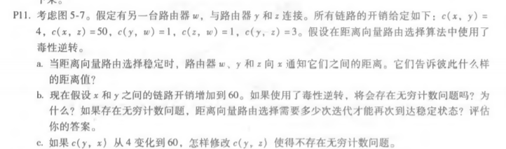
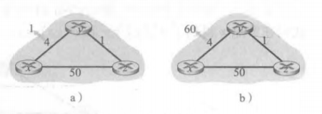

# 第八次作业

徐意 2017312580048

## 课后习题

### P3

| 步骤 | N‘      | D(t),p(t) | D(u),p(u) | D(v),p(v) | D(w),p(w) | D(y),p(y) | D(z),p(z) |
| ---- | ------- | --------- | --------- | --------- | --------- | --------- | --------- |
| 0    | x       | ∞         | ∞         | 3,x       | 6,x       | 6,x       | 8,x       |
| 1    | xv      | 7,v       | 6,u       |           | 6,x       | 6,x       | 8,x       |
| 2    | xvy     | 7,v       | 6,u       |           | 6,x       |           | 8,x       |
| 3    | xvyw    | 7,v       | 6,u       |           |           |           | 8,x       |
| 4    | xvywu   | 7,v       |           |           |           |           | 8,x       |
| 5    | xvywut  |           |           |           |           |           | 8,x       |
| 6    | xvywutz |           |           |           |           |           |           |

### P5

| From/To | z    | x    | v    | u    | y    |
| ------- | ---- | ---- | ---- | ---- | ---- |
| z       | 0    | 2    | 6    | ∞    | ∞    |
| x       | ∞    | ∞    | ∞    | ∞    | ∞    |
| v       | ∞    | ∞    | ∞    | ∞    | ∞    |

| From/To | z    | x    | v    | u    | y    |
| ------- | ---- | ---- | ---- | ---- | ---- |
| z       | 0    | 2    | 5    | 7    | 5    |
| x       | 2    | 0    | 3    | ∞    | 3    |
| v       | 6    | 3    | 0    | 1    | ∞    |

| From/To | z    | x    | v    | u    | y    |
| ------- | ---- | ---- | ---- | ---- | ---- |
| z       | 0    | 2    | 5    | 6    | 5    |
| x       | 2    | 0    | 3    | 4    | 3    |
| v       | 5    | 3    | 0    | 1    | 3    |

| From/To | z    | x    | v    | u    | y    |
| ------- | ---- | ---- | ---- | ---- | ---- |
| z       | 0    | 2    | 5    | 6    | 5    |
| x       | 2    | 0    | 3    | 4    | 3    |
| v       | 5    | 3    | 0    | 1    | 3    |

### P11

a. 

| From | To   | D(x) |
| ---- | ---- | ---- |
| w    | y    | ∞    |
| w    | z    | 5    |
| y    | w    | 4    |
| y    | z    | 4    |
| z    | w    | 6    |
| z    | y    | ∞    |

b. 会存在无穷计数问题。

| time | t0           | t1          | t2          | t3           | t4           |
| ---- | ------------ | ----------- | ----------- | ------------ | ------------ |
| Z    | → w, Dz(x)=∞ |             |             | → w, Dz(x)=∞ |              |
|      | →y, Dz(x)=6  |             |             | →y, Dz(x)=11 |              |
| W    | →y, Dw(x)=∞  |             | →y, Dw(x)=∞ |              |              |
|      | →z,Dw(x)=5   |             | →z,Dw(x)=10 |              |              |
| Y    | →w, Dy(x)=4  | →w, Dy(x)=9 |             |              | →w, Dy(x)=14 |
|      | →z, Dy(x)=4  | →z, Dy(x)=∞ |             |              | →z, Dy(x)=∞  |

t1到t4形成一个循环。

在T27，z通过它与x的直接联系检测到它对x的最小成本是50。在T29，w通过z得知它对x的最小成本为51。在t30，y将其最小成本更新为52(通过w)。最后，在T31，没有更新，路由是稳定的。需要31次迭代。

| time | t27          | t28          | t29          | t30           |
| ---- | ------------ | ------------ | ------------ | ------------- |
| Z    | →w, Dz(x)=50 |              |              |               |
|      | →y, Dz(x)=50 |              |              |               |
| W    |              |              | →y, Dw(x)=51 |               |
|      |              | →z, Dw(x)=50 | →z, Dw(x)= ∞ |               |
| Y    |              | →w, Dy(x)=53 |              | →w, Dy(x)=∞   |
|      |              | →z, Dy(x)=∞  |              | →z, Dy(x)= 52 |

c. 让 c(y,z)=∞
